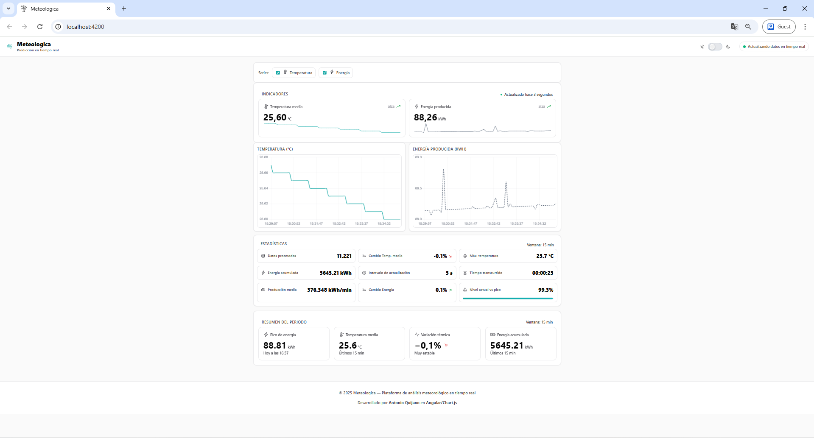

# 🌤️ Weather Dashboard

A modern, real-time weather dashboard application built with Angular that visualizes meteorological data with progressive streaming, interactive charts, and advanced analytics tools.

## 📸 Application Preview



## 📋 Project Description

This web application provides real-time visualization of weather prediction data, including temperature and energy production metrics. The application simulates progressive data streaming every 5 seconds, displaying interactive charts with automatic updates, comprehensive statistics, and powerful analysis tools.

## ✨ Key Features

### Real-time Data Streaming
- ⚡ **Progressive Updates**: Automatic data updates every 5 seconds
- 📊 **Live Visualization**: Dynamic KPI cards and statistics
- 📈 **Interactive Charts**: Minute-by-minute intervals with precise tooltips
- 🔄 **Sliding Window**: Maintains last 60 data points for optimal performance

### Advanced Analytics Tools
- 📊 **Period Comparison**: Compare current vs previous periods with visual indicators
- 🔔 **Smart Alerts**: Configure threshold-based notifications for temperature and energy
- 🔍 **Advanced Filters**: Filter by temperature range, energy range, time of day, days of week, and trends
- 💾 **Saved Views**: Save and restore dashboard configurations

### Data Export
- 📥 **Export Charts**: Download charts as PNG images (individual or combined)
- 📊 **Export Data**: Export to CSV or JSON formats
- 📈 **Export Statistics**: Get detailed stats in JSON format

### User Experience
- 🎨 **Modern UI**: Clean, professional design with subtle shadows and smooth transitions
- 🌓 **Theme Toggle**: Switch between light and dark themes (keyboard shortcut: `T`)
- 📱 **Fully Responsive**: Optimized for desktop, tablet, and mobile devices
- ♿ **Accessible**: ARIA labels, keyboard navigation, and focus management
- ⌨️ **Keyboard Shortcuts**: Power user features with keyboard controls

### Interactive Features
- 📈 **Time Range Selection**: View data for Last Hour, 6 Hours, 24 Hours, or Week
- 👁️ **Series Visibility**: Toggle temperature and energy series on/off
- 📊 **Chart Interaction**: Zoom, pan, and hover for detailed information
- 🎯 **Contextual Help**: Built-in tutorial and project documentation modal

## 🛠️ Technologies Used

- **Framework**: Angular 17 (standalone components)
- **Language**: TypeScript
- **Charts**: Chart.js 4.5.1 with zoom plugin
- **Data Processing**: js-yaml 4.1.0
- **Styling**: CSS3 with custom properties (CSS variables)
- **Reactive Programming**: RxJS 7.8 (Observables, BehaviorSubject)
- **Icons**: Lucide Angular
- **Date Handling**: date-fns 4.1.0

## 📦 Project Structure

```
weather-dashboard/
├── src/
│   ├── app/
│   │   ├── components/
│   │   │   ├── header/              # Header with theme toggle
│   │   │   ├── footer/              # Footer component
│   │   │   ├── kpi-card/            # KPI card component
│   │   │   ├── statistics/          # Statistics grid component
│   │   │   └── toolbar/             # Toolbar component
│   │   ├── services/
│   │   │   ├── weather-data-loader.service.ts   # YAML loading and parsing
│   │   │   ├── weather-converter.service.ts     # Unit conversion
│   │   │   └── weather-stream.service.ts        # Progressive data streaming
│   │   ├── app.component.ts         # Main component
│   │   ├── app.component.html       # Dashboard template
│   │   ├── app.component.css        # Component styles
│   │   └── app.config.ts            # Global configuration
│   ├── styles.css                   # Global styles and CSS variables
│   └── index.html                   # Main HTML file
├── docs/                            # Documentation and screenshots
├── package.json                     # Dependencies
├── angular.json                     # Angular configuration
├── tsconfig.json                    # TypeScript configuration
├── Dockerfile                       # Docker configuration
└── README.md                        # This file
```

## 🚀 Installation and Execution

### ✅ Prerequisites

- Node.js (v18 or higher)
- npm (included with Node.js)

### ▶️ Steps to Run the Application

1. **Install dependencies**
   ```bash
   npm install
   ```

2. **Start the development server**
   ```bash
   npm start
   ```
   or
   ```bash
   ng serve
   ```

3. **Open in browser**
   Navigate to `http://localhost:4200/`

## 📊 How the Application Works

### Data Loading
The `WeatherDataLoaderService` reads and parses the YAML file containing weather data.

### Progressive Streaming
`WeatherStreamService` emits a new data point every 5 seconds, maintaining a sliding window of the last 60 points.

### UI Updates
The main component automatically updates:
- Current values (top KPI cards)
- Historical charts (last 60 data points)
- Statistics (average, max, min, totals)
- Trend indicators (up/down arrows)

### Unit Conversion
`WeatherConverterService` automatically converts:
- **Temperature**: deciKelvins (dK) → Celsius (°C)
  - Formula: °C = (dK / 10) - 273.15
- **Energy**: Watt-hours (Wh) → Kilowatt-hours (kWh)

## 🔧 Services and Components

### 1. WeatherDataLoaderService
- Loads and parses YAML files
- Prepares data for streaming
- Handles file format validation

### 2. WeatherStreamService
- Emits new data every 5 seconds
- Maintains a buffer with recent history
- Manages data flow and subscriptions

### 3. WeatherConverterService
- Converts meteorological units to readable formats
- Temperature: dK → °C
- Energy: Wh → kWh

### 4. AppComponent
- Renders the complete dashboard
- Manages subscriptions and UI lifecycle
- Handles user interactions and tool modals

## 🎨 Design System

### Color Palette
- **Primary Accent**: `#0ea5e9` (Sky Blue)
- **Temperature Series**: `#0ea5e9` (Sky Blue)
- **Energy Series**: `#475569` (Slate Gray)
- **Success/Trend Up**: `#059669` (Green)
- **Error/Trend Down**: `#dc2626` (Red)

### Design Features
- Clean layout with card-based design
- Subtle shadows and borders
- Smooth transitions and micro-interactions
- Sparklines optimized for retina displays
- Fully responsive from desktop to mobile
- Accessible color contrast ratios

## ⌨️ Keyboard Shortcuts

- `T` - Toggle theme (light/dark)
- `C` - Toggle comparison mode
- `A` - Open alerts modal
- `F` - Open filters modal
- `V` - Open saved views modal
- `H` or `?` - Open help modal
- `Ctrl/Cmd + E` - Export data as CSV
- `Ctrl/Cmd + Shift + E` - Export charts as combined image
- `1-4` - Select time range (Last Hour, 6 Hours, 24 Hours, Week)
- `Esc` - Close active modal

## 📈 Optimizations Implemented

- **Sliding Window**: Only maintains last 60 data points
- **Incremental Updates**: Charts update without reloading entire dataset
- **Optimized Animations**: Uses Chart.js `update('none')` mode
- **Memory Management**: Proper cleanup in `ngOnDestroy()`
- **Selective Imports**: Only imports required Chart.js modules
- **CSS Variables**: Efficient theming and customization

## 🧪 Testing

The application has been thoroughly tested and verified for:

### ✅ Functional Testing
- **Real-time Data Streaming**: Verified 5-second update intervals working correctly
- **Modal Functionality**: Alerts, Filters, and Saved Views modals open/close correctly
- **Comparison Mode**: Panel displays correctly and updates with period comparisons
- **Keyboard Shortcuts**: All shortcuts (T, C, A, F, V, H, Esc, Ctrl+E) function properly
- **Data Export**: CSV, JSON, and PNG export features verified

### ✅ UI/UX Testing
- **Responsive Design**: Tested across different screen sizes (mobile, tablet, desktop)
- **Theme Toggle**: Light/dark mode switching works smoothly
- **Modal Overlays**: Correct backdrop and click-outside-to-close functionality
- **Button States**: Active states display correctly for tools and time ranges
- **Chart Interactions**: Zoom, pan, and tooltip functionality verified

### ✅ Browser Compatibility
- Tested in modern browsers (Chrome, Firefox, Edge)
- Accessibility features (ARIA labels, keyboard navigation) verified
- Console errors checked (no critical errors)

### Running Tests

```bash
ng test              # Run unit tests with Karma/Jasmine
```

### Manual Testing Checklist
- ✅ Modals open and close correctly
- ✅ Only one modal open at a time
- ✅ Escape key closes active modals
- ✅ Click outside modal closes it
- ✅ Comparison panel displays as compact inline panel
- ✅ Real-time data updates every 5 seconds
- ✅ All keyboard shortcuts work
- ✅ Export functions work correctly
- ✅ Theme toggle functions properly
- ✅ Responsive design works on mobile/tablet/desktop

## 📝 Technical Requirements (Met)

✅ Progressive streaming every 5 seconds  
✅ Real-time visualization  
✅ Minute-by-minute charts  
✅ Unit conversion dK → °C  
✅ Responsive design with dark theme  
✅ Advanced analytics and filtering  
✅ Data export capabilities  
✅ Interactive charts with zoom/pan  
✅ Accessibility features  

## 📚 Usage Instructions

### 🔧 Useful Commands

```bash
ng build              # Build for production
ng test               # Run tests
ng serve --open       # Open browser automatically
ng serve --port 4300  # Use different port if 4200 is occupied
```

### ⚠️ Troubleshooting

**Port 4200 is occupied:**
```bash
ng serve --port 4300
```

**Dependency issues:**
```bash
rm -rf node_modules package-lock.json
npm install
```

**Application not updating:**
- Check browser console (F12)
- Ensure JavaScript is enabled
- Try incognito mode
- Clear browser cache

## 🐳 Docker Deployment

Deploy the application without installing Node.js using Docker:

### 🛠️ Build the image
```bash
docker build -t weather-dashboard .
```

### ▶️ Run the container
```bash
docker run --name weather-dashboard -d -p 8080:80 weather-dashboard
```

Access at: `http://localhost:8080`

### 🔄 Redeploy cycle
```bash
docker stop weather-dashboard || true
docker rm weather-dashboard || true
docker build -t weather-dashboard .
docker run --name weather-dashboard -d -p 8080:80 weather-dashboard
```

### 📊 Logs and maintenance
```bash
docker logs -f weather-dashboard    # View logs
docker stop weather-dashboard       # Stop container
docker rm weather-dashboard         # Remove container
```

💡 **Note**: If port 8080 is occupied, use another: `-p 8081:80`

### 📦 Docker Compose Option

Create `docker-compose.yml`:

```yaml
services:
  weather-dashboard:
    build: .
    image: weather-dashboard:latest
    ports:
      - "8080:80"
    container_name: weather-dashboard
    restart: unless-stopped
```

Commands:
```bash
docker compose up -d              # Start
docker compose logs -f            # View logs
docker compose down               # Stop
```

### 🐳 How the Dockerfile Works

- **Stage 1 (Node 18-alpine)**: Installs dependencies and compiles Angular
- **Stage 2 (nginx:alpine)**: Serves static files from `/usr/share/nginx/html`

✅ Result: Lightweight, fast, production-ready image

## 📐 Unit Conversion

### Temperature Conversion

```typescript
convertDKToCelsius(dK: number): number {
  return (dK / 10) - 273.15;
}
```

**Formula**: °C = (dK / 10) - 273.15

### Energy Conversion

Energy values are automatically converted from Watt-hours (Wh) to Kilowatt-hours (kWh).

## 📁 Expected YAML Data Format

```yaml
temperature:
  unit: "dK"
  values:
    - time: "00:00:00"
      value: 2921
    - time: "00:00:05"
      value: 2921
    - time: "00:00:10"
      value: 2920
    # ... more entries

energy:
  unit: "Wh"
  values:
    - time: "00:00:00"
      value: 1250
    - time: "00:00:05"
      value: 1280
    # ... more entries
```

## 👤 Author

**Antonio Quijano Bernedo**

Weather Dashboard developed as a technical assessment project.

**Technologies**: Angular · TypeScript · Chart.js · RxJS · Docker · CSS3

---

**Built with ❤️ using modern web technologies**
